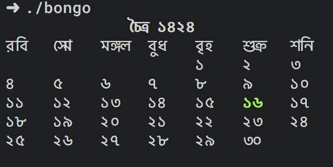
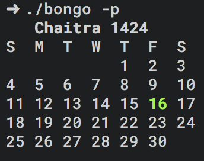

Bongo
========
Terminal based bengali calendar

# Installation

1. [Download binary from here](https://github.com/thedevsaddam/bongo/raw/master/bin.zip)
1. Unzip the bin file
1. For unix user `cp your_bin_file /usr/local/bin/bongo`
1. Make the file executable `chmod +x /usr/local/bin/bongo`

# Usage
* `$ bongo` print bengali ponjika in bengali font
* `$ bongo -p` print bengali ponjika in english phonetic.

# Special thanks
* [Nuhil Mehdy](https://github.com/nuhil)
* [Ahmed shamim](https://github.com/me-shaon)
* [Sajib Sikder](https://github.com/mhshajib)
